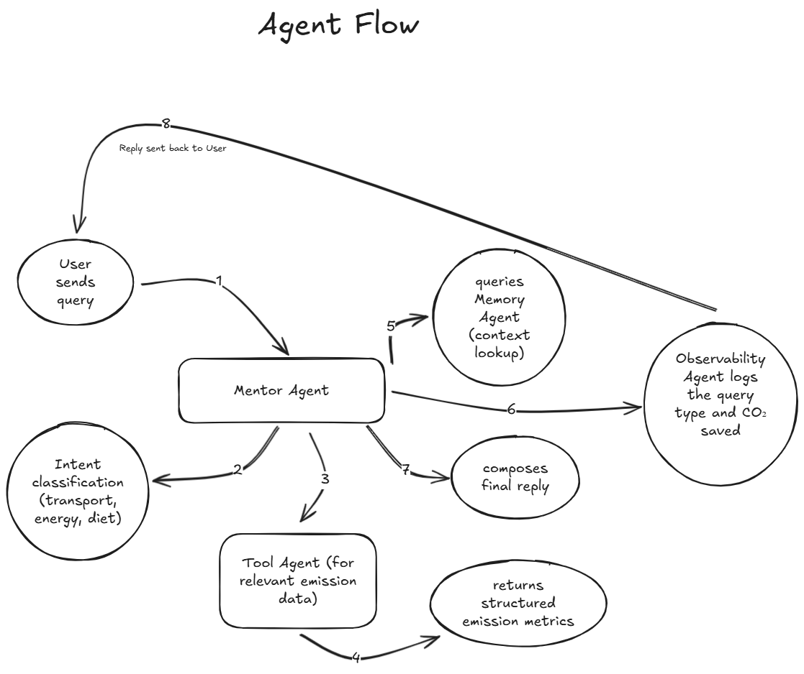

# 🌱 **EcoMentor – Agentic Sustainability Coach**


[](https://www.kaggle.com/)
[]()
[]()
[]()
[]()
[]()

## 🧭 Overview
EcoMentor is a conversational **Agentic Sustainability Coach** that helps people reduce their carbon footprint using a **LLM-powered multi-agent system**.

The system understands user habits, tracks positive environmental actions, calculates emissions, and provides personalized sustainability guidance using:

✔ LLM Mentor Agent  
✔ Intent Agent  
✔ Tool Agent  
✔ Memory Agent  
✔ Observability Agent  

---

## ⚙️ Architecture

### **1. High-level Architecture**


### **2. Agent Flow (Full Pipeline)**


### **3. Internal Agent Logic**


---

## 🧠 Core Kaggle Concepts Demonstrated
- **Multi-Agent System**
- **Custom Tools**
- **Sequential + Parallel Agent Calls**
- **Session Memory + SIS Scoring**
- **Observability & Metrics**
- **Context Engineering**

---

## ⚡ Tech Stack
- FastAPI  
- Streamlit  
- GPT‑4o‑mini  
- Python 3.10+  
- JSON memory & metrics logger  

---

## 🧪 API Endpoints
### `POST /chat`
### `GET /metrics`

---

## 🎛️ Streamlit Frontend
- Chat UI  
- SIS Score  
- Metrics Dashboard  

---

## 🧩 Project Structure
```
EcoMentor/
│
├── backend/
│   ├── main.py                     # FastAPI entrypoint
│   ├── metrics.json                # Observability + logging data
│   │
│   ├── agents/                     # All agents inside here
│   │   ├── intent_agent.py
│   │   ├── mentor_agent.py
│   │   ├── tool_agent.py
│   │   ├── memory_agent.py
│   │   ├── observability_agent.py
│   │   ├── orchestrator_agent.py
│   │   └── reporter_agent.py
│   │
│   ├── utils/
│   │   ├── config.py               # Configuration utilities
│   │   └── logger.py               # Logging helper
│   │
│   └── __pycache__/                # Auto-generated Python cache
│
├── frontend/
│   └── streamlit_app.py            # Streamlit UI interface
│
├── diagrams/                       # Visual documentation
│   ├── agent_flow.png
│   ├── agent_logic.png
│   └── system_architecture.png
│
├── .env                            # Environment variables (ignored in git)
├── .gitignore
├── LICENSE
└── README.md

```

---

## 🚀 How to Run EcoMentor  
Complete setup, run instructions, demo section, and testing guide.

---

### ⚙️ Installation & Setup

### **1️⃣ Clone the Repository**
```bash
git clone https://github.com/<your-username>/EcoMentor.git
cd EcoMentor
```

### **2️⃣ Create & Activate Virtual Environment**
```bash
python -m venv .venv
source .venv/bin/activate    # Mac/Linux
.\.venv\Scripts\activate   # Windows
```

### **3️⃣ Install Dependencies**
```bash
pip install -r requirements.txt
```

---

### 🔐 Environment Variables

Create a `.env` file in the root directory:

```
OPENAI_API_KEY=your_openai_api_key_here
```

---

### 🖥️ Running the Backend (FastAPI)

From project root:

```bash
uvicorn backend.main:app --reload
```

Backend UI available at:

- **http://127.0.0.1:8000**
- **/docs** → Swagger API docs  
- **/chat** → POST endpoint  
- **/metrics** → GET metrics  

---

### 🎨 Running the Frontend (Streamlit UI)

In another terminal:

```bash
cd frontend
streamlit run streamlit_app.py
```

Streamlit UI opens at:

👉 **http://localhost:8501**

---

### 🔄 End-to-End Flow

1. User sends message via Streamlit  
2. FastAPI orchestrator receives input  
3. Mentor Agent routes to Intent Agent  
4. Tool Agent calculates emissions (if needed)  
5. Memory Agent returns context, SIS, positive actions  
6. Mentor composes reply  
7. Observability logs data → `metrics.json`  
8. Streamlit displays message + updates dashboard  

---

### 💬 Example Queries (Try These)

```
"Calculate emissions for driving 10 km."
"I biked instead of taking the car today."
"I planted 3 trees this weekend."
"How do I lower my electricity usage?"
"Show my weekly summary."
```

These cover:
- Emission estimation  
- Positive actions  
- SIS scoring  
- Memory retrieval  
- Observability logging  

---

### 🧪 Quick Backend Testing (curl)

### Chat:
```bash
curl -X POST "http://127.0.0.1:8000/chat" -H "Content-Type: application/json" -d '{"session_id": "test123", "message": "I cycled to work today"}'
```

### Metrics:
```bash
curl http://127.0.0.1:8000/metrics
```

---
## 📹 Project Demo Video (YouTube)

**YouTube Link:** _Coming Soon_  
 
---

## 🚀 Future Enhancements
- Live electricity data  
- Trend visualizations  
- WhatsApp/SMS bot  

---

Built for **Kaggle Agent Intensive — Agents for Good**.
By **Ujwal Mojidra**.
